**Integrantes**   
Daniel Alejandro Diaz Camelo.  
Vicente Garzon Rios.

**Pasos**  
1. Creamos el proyecto maven.  

  

2. Agregamos las dependencias de JUnit. 

  

3. Verificamos la verion de java.  

4. Agregamos el plugin para ejecutar java.  

  

5. Verificamos que compile correctamente.  

  

6. Agregamos el esqueleto del proyecto.  

  

7. Creamos las diferentes clases.  

  
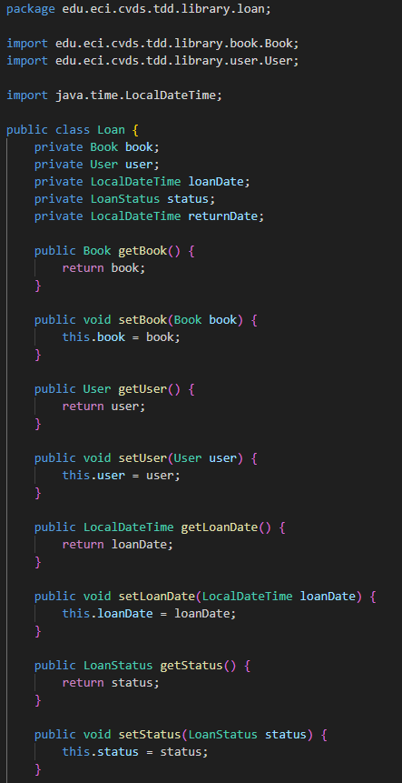  
  
  
  

8. Creamos la clase de pruebas para Library.  

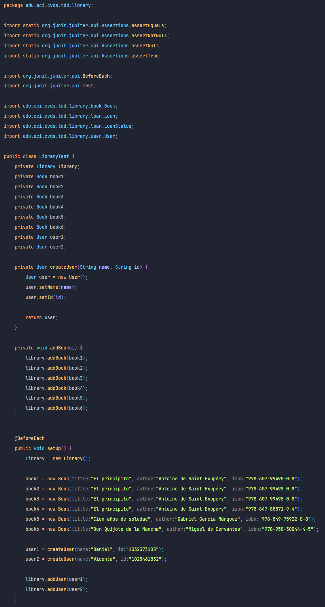  

9. Implementamos las pruebas para el metodo addBook y luego verificamos que estas fallen.  

  
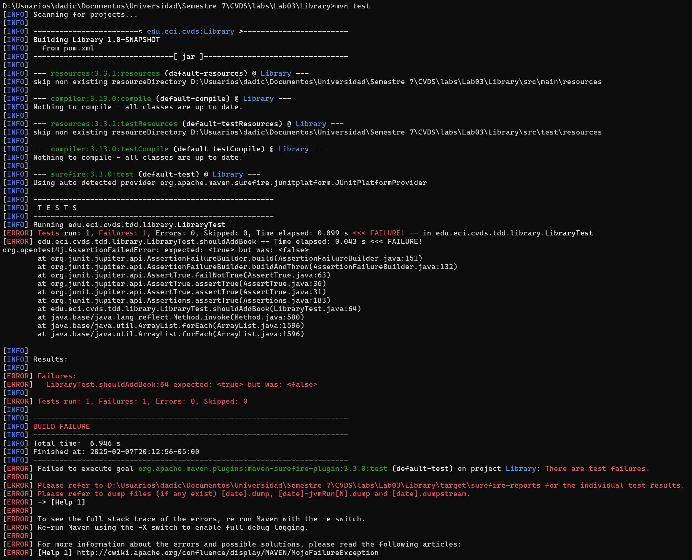  
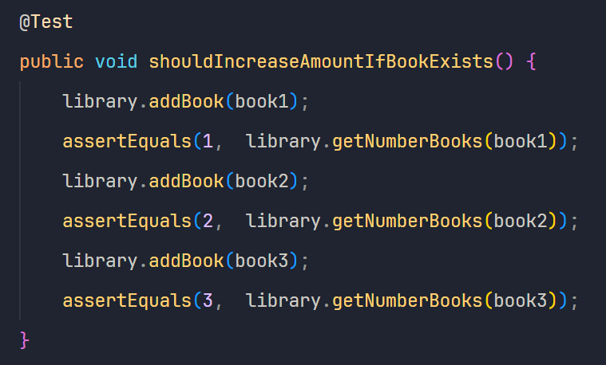  
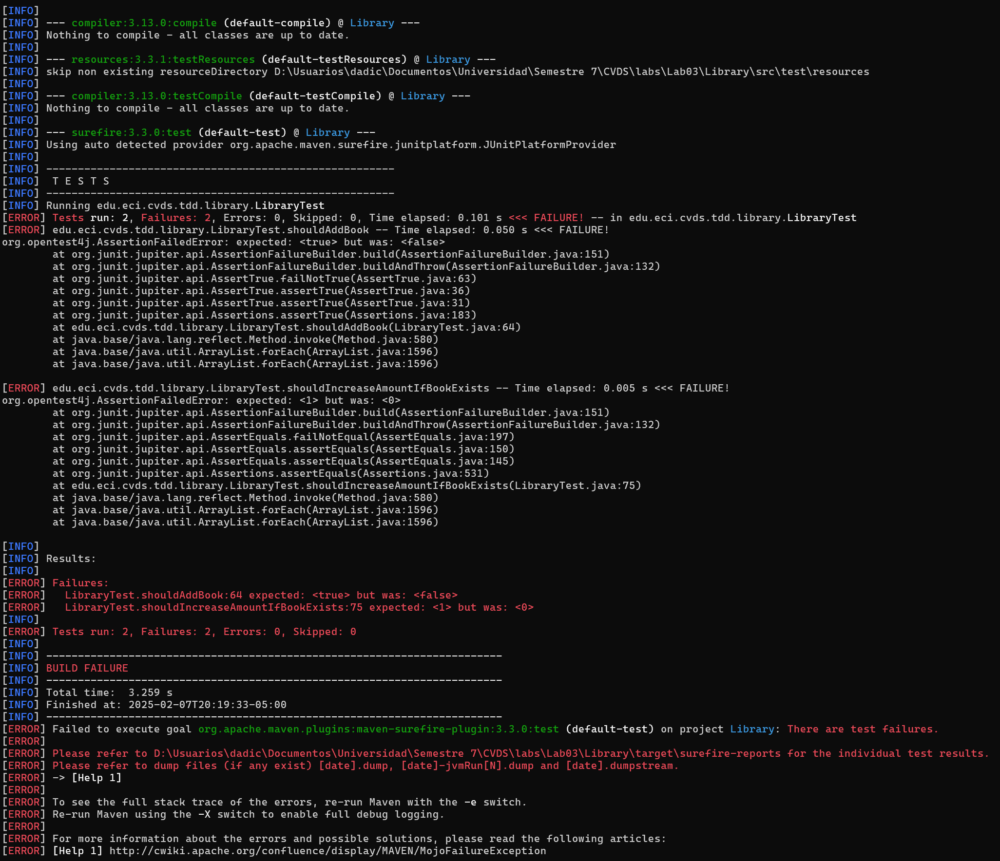  
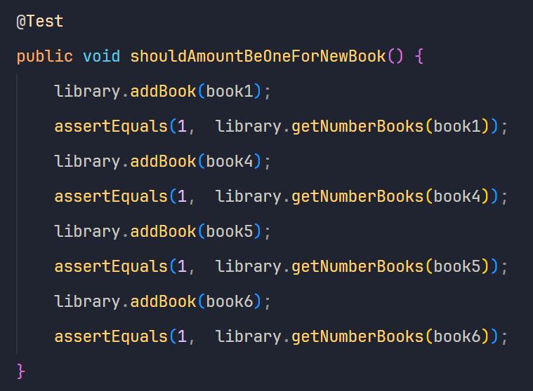  
  

10. Implementamos las pruebas para el metodo loanBook y luego verificamos que estas fallen. 

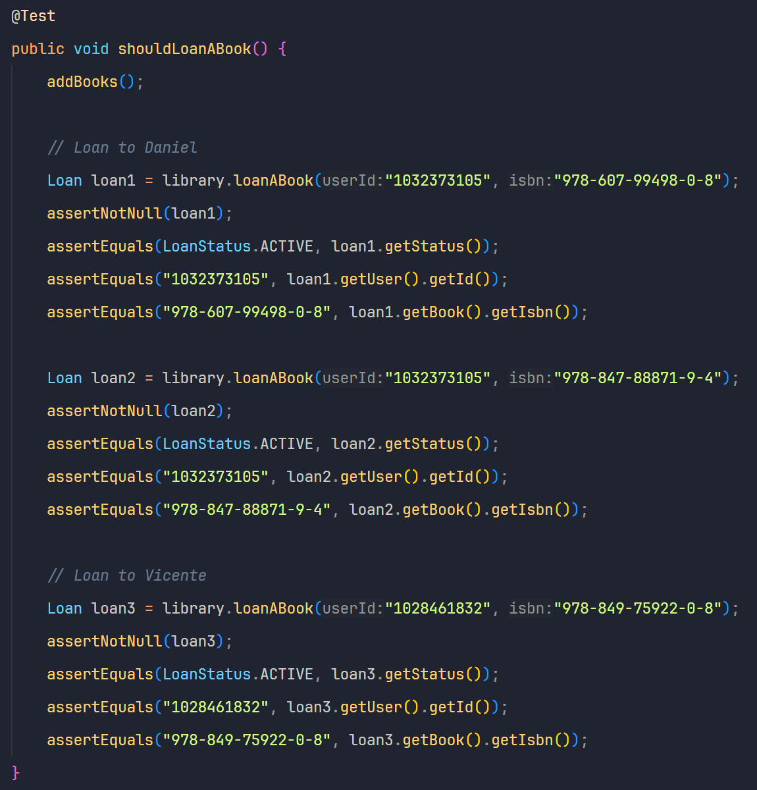  
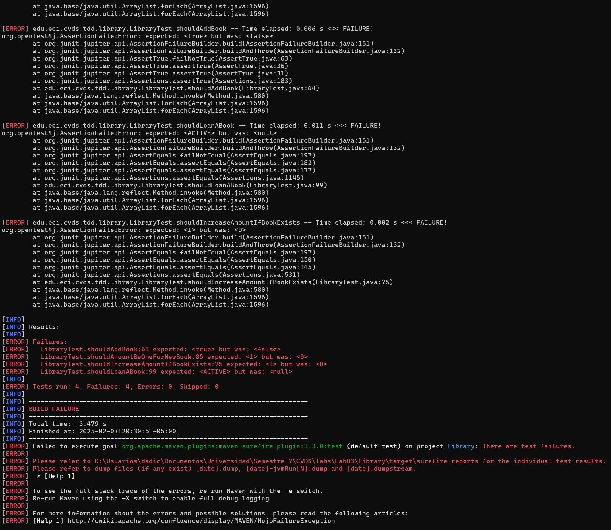  
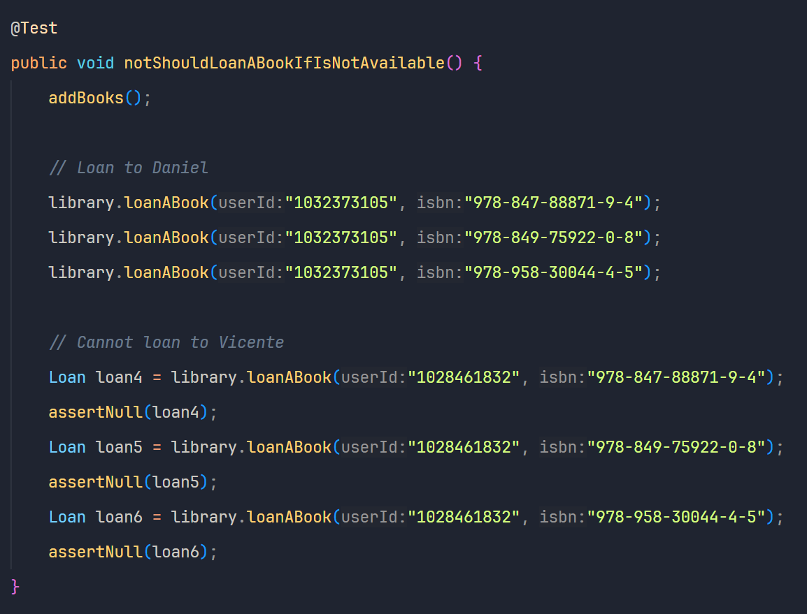  
  
  
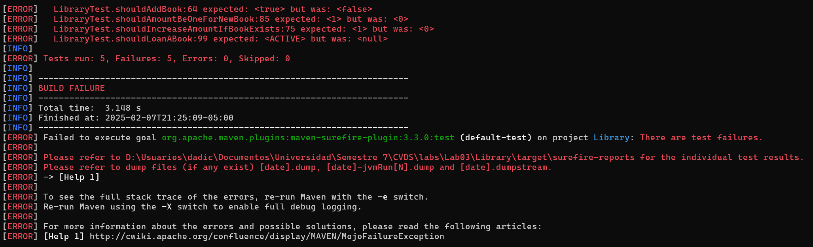  
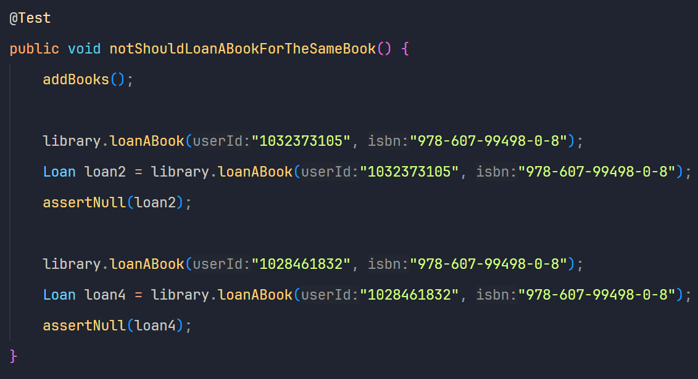  
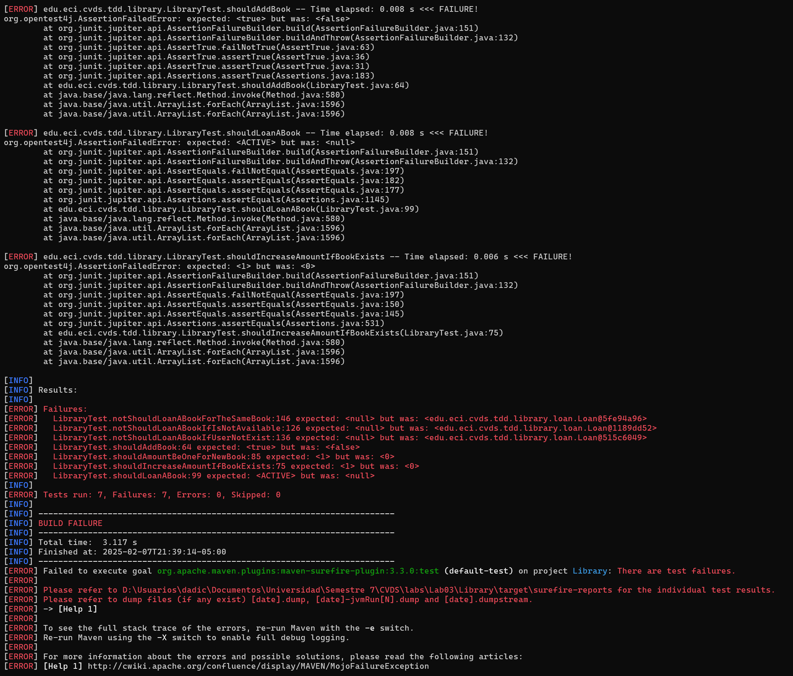  
  
  

11. Implementamos las pruebas para el metodo returnLoan y luego verificamos que estan fallen.  

  
  
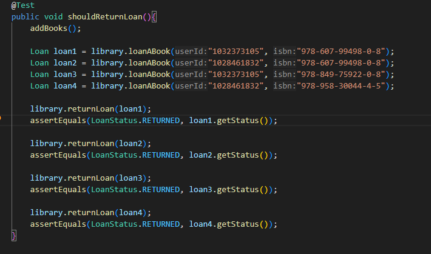  
  
  
  

12. Implementamos el método addBook. Sobrescribimos el método hashCode en la clase Book para que los libros con el mismo isbn sean tratados como la misma clave en el HashMap de la clase Library. Esto evita duplicados no deseados y permite gestionar correctamente la cantidad de ejemplares de cada libro.  

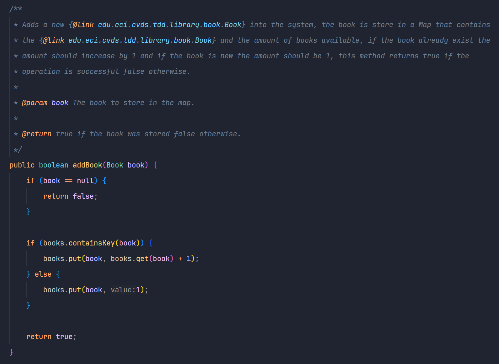  
  

13. Implementamos el método loanABook. Sobrescribimos el método equals en la clase User para que la comparación entre usuarios se realice en función de su id, garantizando que dos objetos User con el mismo id sean tratados como el mismo usuario.    

  
  
  
  

14. Implementamos el método returnLoan. Implementamos el método equals de la clase Loan para poder realizar la comparativa.  

  
  

13. Ejecutamos las pruebas para verificar que todas pasen exitosamente, asegurándonos de que los cambios implementados cumplen con los requisitos establecidos en TDD.  

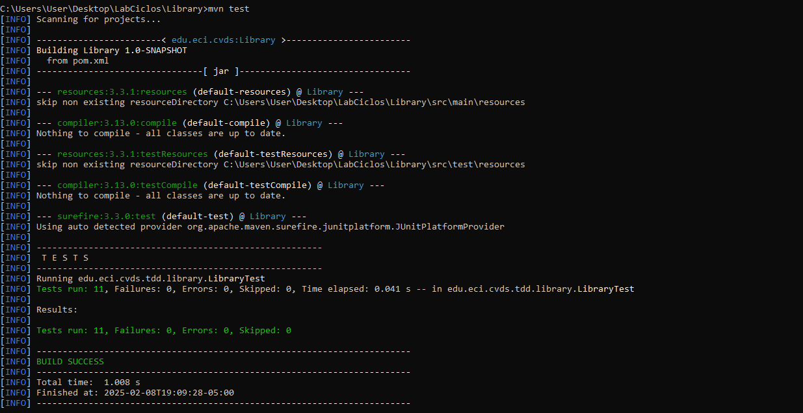  

x. Agregamos la dependencia de jacoco.  
   